#### These procedure steps will be followed on the simulator

1. Open the simulation of hardness of water, go through the given Description and Solutions used and click on NEXT button shown at the bottom right corner. 
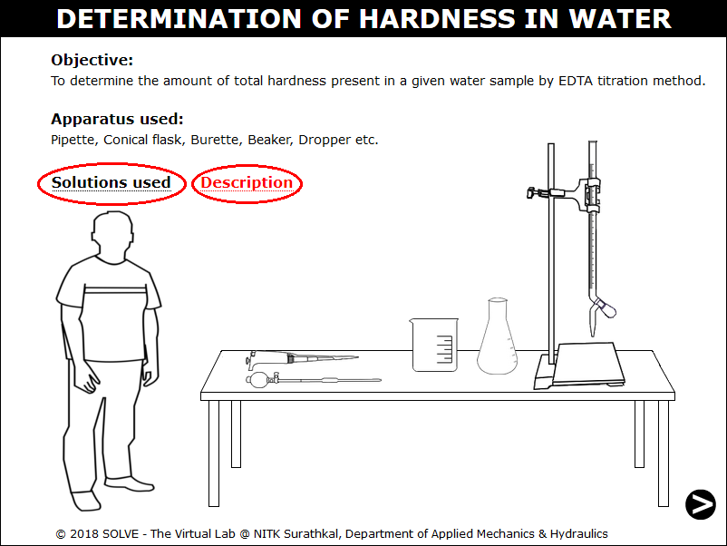 

2. Click on funnel to place it in the burette to add 200ml test sample. 
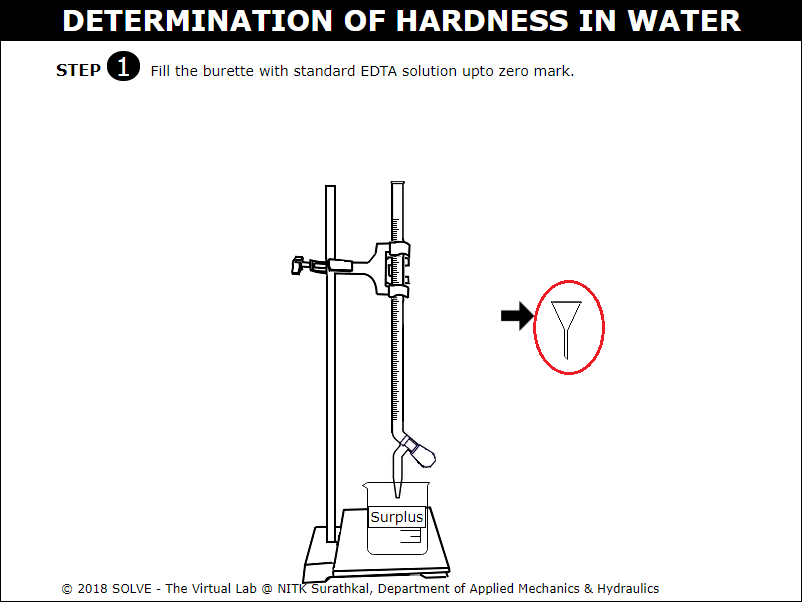 

3. Click on the lid to open and pour EDTA solution on to the burette upto zero mark. 
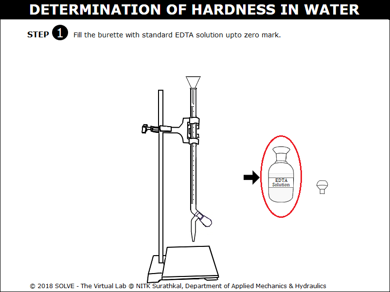 

4. Remove the funnel by clicking on it. 
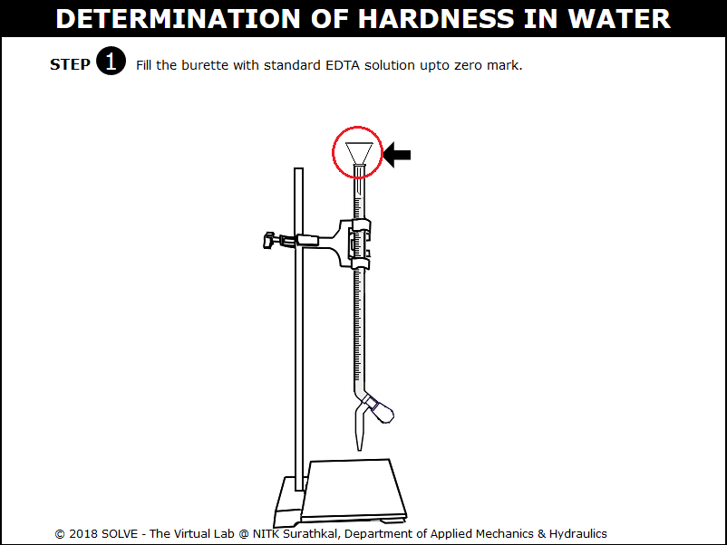 

5. Click on NEXT button once the funnel is removed. 
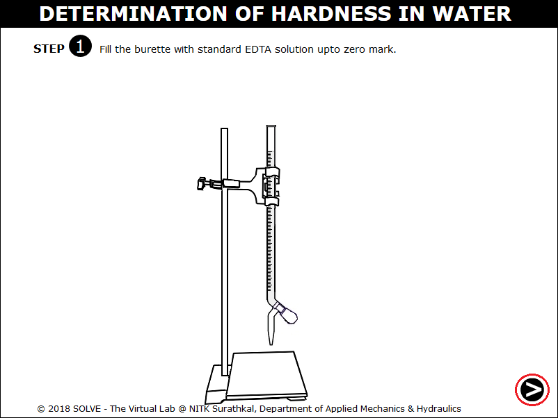 

6. Squeeze the pipette bulb by clicking on it and press the up arrow to take the CaCO3 solution up into the pipette. 
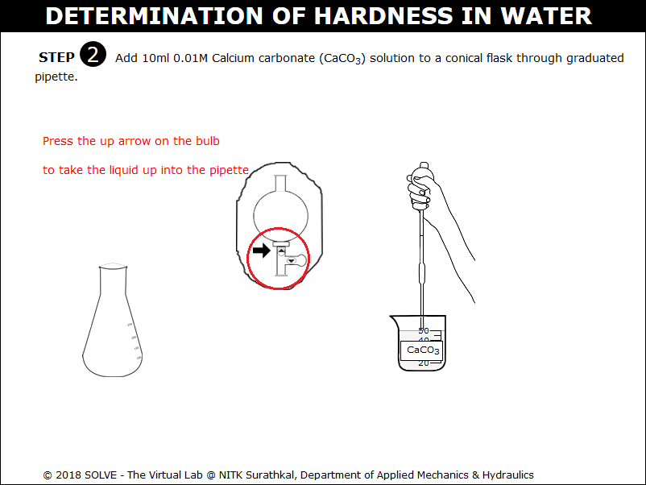 

7. Press the down arrow to release liquid into the beaker. 
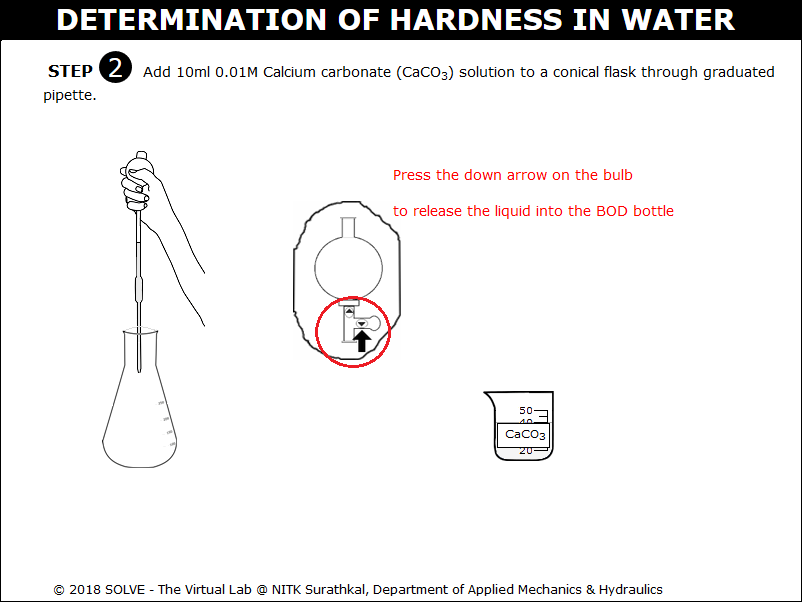 

8. Note the addition of 10ml 0.01M Calcium carbonate solution to conical flask. Click on NEXT button. 
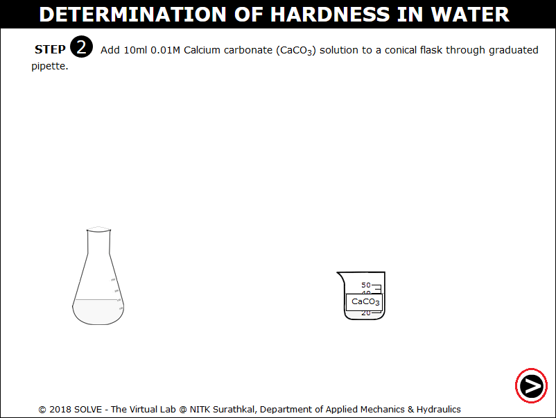 

9. Click on the pipette to add ammonia buffer solution to the conical flask. 
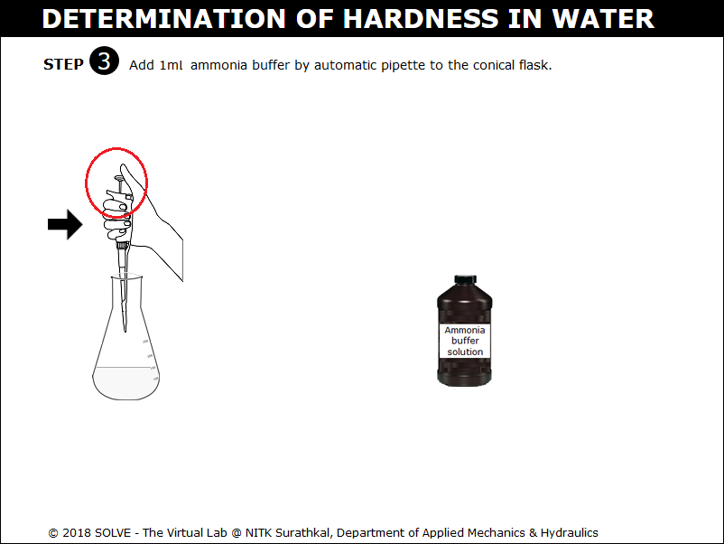 

10. Select answer to the displayed question and then click on the NEXT button. 
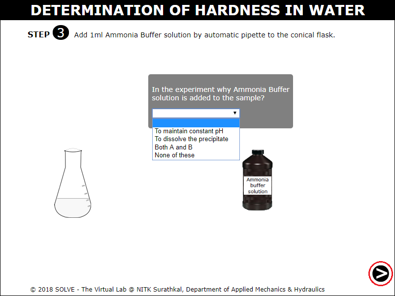 

11. Click on the dropper to add 5-6 drops of E. B.T indicator to the conical flask. 
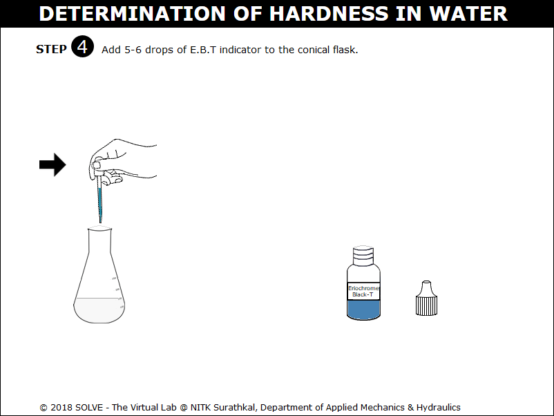 

12. Observe the colour change of solution to wine red and click on the NEXT button. 
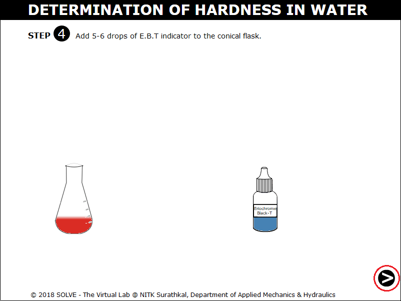 

13. Click on the knob to add the ETDA solution into the conical flask. 
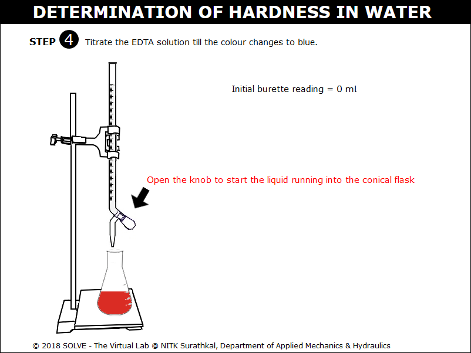 

14. Observe the colour change of the solution in the conical flask to blue. Click on the NEXT button. 
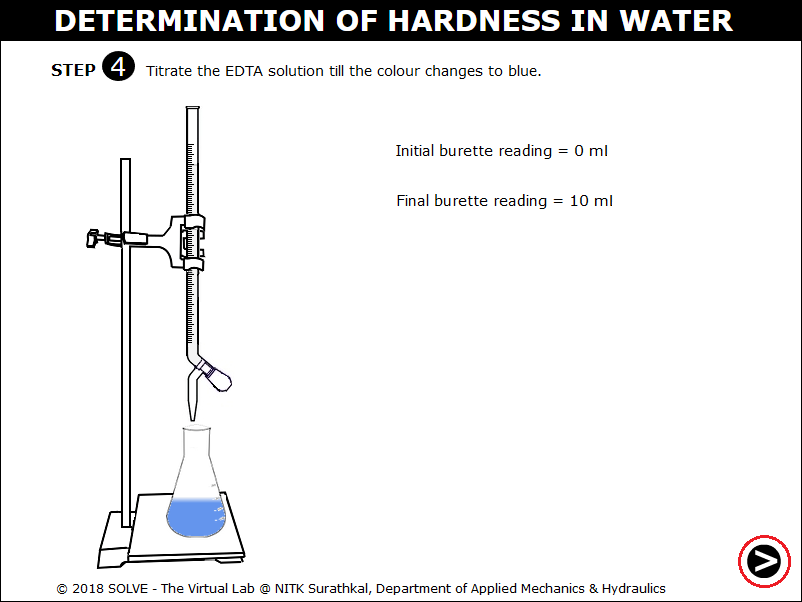 

15. Calculate CaCO3 equivalent to 1ml of ETDA using the formula, enter the value and click on CHECK. 
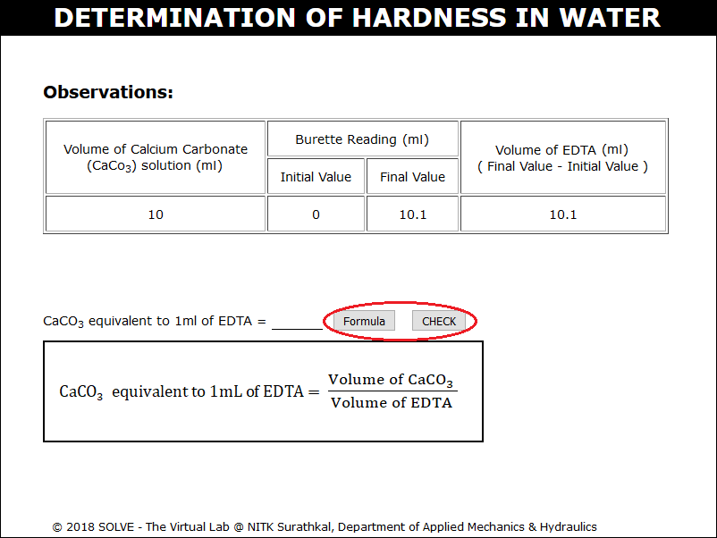 

16. Repeat the same procedure for the 100ml of water sample. Calculate the total hardness of water using the formula and enter the value and click on CHECK. 
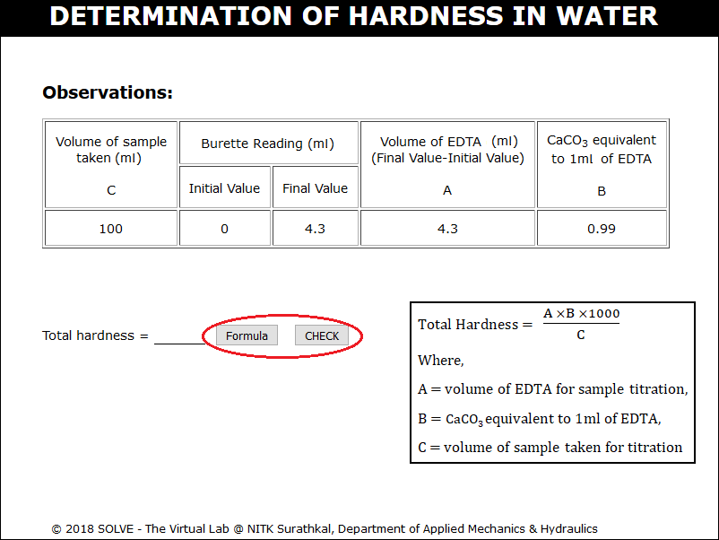 
