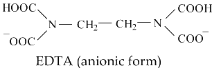

### INTRODUCTION 

Hardness is the degree of ability of water to cause precipitation of insoluble calcium and magnesium salts of higher fatty acids from soap solutions. Hardness can be categorized into two types– permanent hardness and temporary hardness. Temporary hardness is caused due to the presence of bicarbonates of calcium and magnesium. Permanent hardness is non-carbonate hardness and is caused due to the presence of sulphates, chlorides and nitrates of calcium and magnesium.

The hardness of water is significant in determining the suitability of water for domestic and industrial uses. The comparative amount of calcium and magnesium hardness, carbonates and non-carbonates hardness present in water are the aspects while determining the most economical type of softening process. When hard water is heated, Ca2+ ions react with bicarbonate (HCO3-) ions to form insoluble calcium carbonate (CaCO3) (Eq. 1(a)). This precipitate, known as scale, coats the vessels in which the water is heated, producing the mineral deposits on your cooking dishes. Equation 2(a) presents magnesium hardness. 

Ca2+(aq) + 2HCO3(aq) → CaCO3 (s) + H20 + CO2 &nbsp;&nbsp;&nbsp;(Eq. 1(a))  
Mg2+(aq) + 2OH- (aq) → MgOH2 (s)  &nbsp;&nbsp;&nbsp;&nbsp;(Eq. 2a)
 

Carbonate hardness (mg/L) = Alkalinity (2a) 
When alkalinity > Total hardness: Carbonate hardness (mg/L) = Total hardness (2b)

The amount of hardness in excess of this is called “Non-carbonate hardness (NCH)”. These are associated with sulphate chloride, and nitrate ions. It is calculated using Eq (2c) : 

NCH (mg/L) = Total hardness - Carbonate hardness &nbsp;&nbsp;&nbsp;&nbsp;(Eq. 2c) 
 

The ions involved in water hardness, i.e. Ca2+(aq) and Mg2+(aq), can be determined by titration with a chelating agent, Ethylene Diamine Tetra Acetic acid (EDTA), usually in the form of disodium salt (H2Y2-).

The titration reaction is: Ca2+(aq) + H2Y2-(aq) → CaY2-(aq) + 2H+(aq)

 

Eriochrome Black T is often used as indicator for the above titration. At pH 10, Ca2+(aq) ion first complexes with the indicator as CaIn+(aq) which is wine red. As the stronger ligand EDTA is added, the CaIn+(aq) complex is replaced by the CaY2-(aq) complex which is blue. The end point of titration is indicated by a sharp colour change from wine red to blue. Titration using Eriochrome Black T as indicator states total hardness due to Ca2+(aq) and Mg2+(aq) ions. Hardness due to Ca2+(aq) ion is determined by a discrete titration at a higher pH, by adding NaOH solution to precipitate Mg(OH)2(s), by means of hydroxy naphthol blue as indicator.

#### Relevant Indian Standard for Hardness Test on Water :
1. IS 3025 (Part 21) -2009: Method of Sampling and Test (Physical and Chemical) for Water and Wastewater, Hardness, Second Revision.
